 # Single-Cell-Analysis
## A comprehensive pipeline for single-cell RNA-seq analysis using the Seurat package in R. This repository provides step-by-step scripts and visualizations to guide users through loading, processing, analyzing, and visualizing single-cell RNA-seq data. The pipeline is designed to be modular and flexible, making it easy to customize for different datasets and analysis goals.

## Purpose of This Repository
This repository aims to provide a clear and reproducible pipeline for analyzing scRNA-seq data using the Seurat package. The pipeline covers: 
1. 🧪 Quality Control: Filtering low-quality cells and genes.
2. ⚙️ Normalization and Feature Selection: Identifying highly variable genes.
3. 📉 Dimensional Reduction: PCA, UMAP, and t-SNE for visualization.
4. 🗺️ Clustering: Grouping cells into distinct clusters.
5. 🔍 Marker Identification: Finding genes that define each cluster.
6. 📊 Plotting Marker Genes: Visualizing marker gene expression across clusters.
7. 🧬 Cell Type Annotation: Assigning cell types using SingleR and reference datasets.
8. 🔎 Identifying Cell Types Within Clusters: Detecting subpopulations within clusters.
9. ⚖️ Differential Marker Genes: Identifying differentially expressed genes between groups.


## 🚀 Installing Necessary Packages
To install all the required R packages for running this pipeline, simply execute the installation script provided in the Code/ folder.
```r
source("Code/Install.R")
```

## 🧪 1. Quality Control (QC)
```r
### Step 1: Load the Dataset
# Define the path to the dataset
data_path <- "C:/Users/Sourabh/OneDrive/Documents/R/single"

# Load the raw count matrix using Read10X
data <- Read10X(data.dir = data_path)

# Replace underscores with dashes in feature names
rownames(data) <- gsub("_", "-", rownames(data))

### Step 2: Initialize Seurat Object
# Create a Seurat object with basic filtering for low-quality cells
df <- CreateSeuratObject(counts = data, project = "sc_project", min.cells = 3, min.features = 200)

# Clear large data object to free memory
rm(data)

### Step 3: Calculate Quality Control (QC) Metrics
# Calculate mitochondrial gene percentage
df[["percent.mt"]] <- PercentageFeatureSet(df, pattern = "^MT-")

# Calculate ribosomal gene percentage
df[["percent.rb"]] <- PercentageFeatureSet(df, pattern = "^RP[SL]")

### Step 4: Visualize Initial QC Metrics
# Violin plots for QC metrics to inspect distributions
VlnPlot(df, features = c("nFeature_RNA", "nCount_RNA", "percent.mt", "percent.rb"), 
        ncol = 4, pt.size = 0.1, assay = "RNA", layer = "counts") +
  ggtitle("Initial Quality Control Metrics")
```

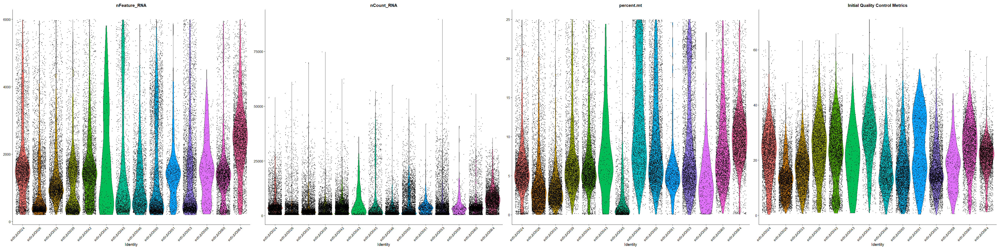
```r
# Scatter plots for QC metric relationships
plot1 <- FeatureScatter(df, feature1 = "nCount_RNA", feature2 = "percent.mt") + 
  ggtitle("RNA Count vs Mitochondrial Percentage") + theme_minimal()

plot2 <- FeatureScatter(df, feature1 = "nCount_RNA", feature2 = "nFeature_RNA") + 
  ggtitle("RNA Count vs Feature Count") + theme_minimal()

plot3 <- FeatureScatter(df, feature1 = "nCount_RNA", feature2 = "percent.rb") + 
  ggtitle("RNA Count vs Ribosomal Percentage") + theme_minimal()

plot1 + plot2 + plot3
```
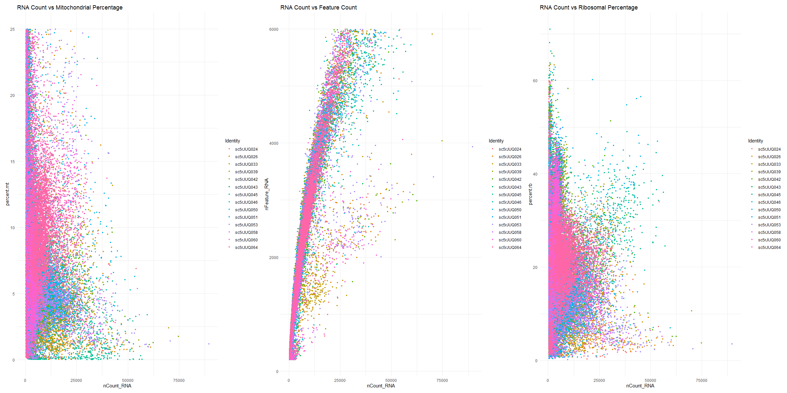
```r
### Step 5: Filter Based on QC Metrics
# Filter cells based on observed QC thresholds
df <- subset(df, subset = nCount_RNA < 75000 & 
                          nFeature_RNA < 5000 & 
                          percent.mt < 15 & 
                          percent.rb < 50)

### Step 6: Visualize QC Metrics After Filtering
# Violin plots for QC metrics post-filtering
VlnPlot(df, features = c("nFeature_RNA", "nCount_RNA", "percent.mt", "percent.rb"), 
        ncol = 4, pt.size = 0.1, assay = "RNA", layer = "counts") +
  ggtitle("Quality Control Metrics After Filtering")
```
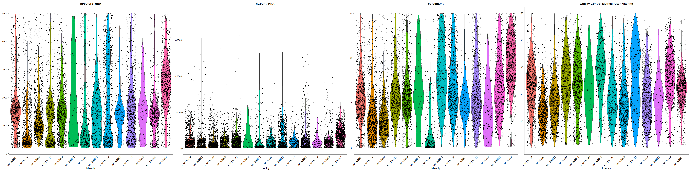


## ⚙️ 2. Normalization and Identification of Highly Variable Genes
```r
### Step 1: Normalize the Data

# Log-normalize the data
df <- NormalizeData(df, normalization.method = "LogNormalize", scale.factor = 10000)

### Step 2: Normalization and Identification of Highly Variable Features

# Identify highly variable features using the 'vst' method
df <- FindVariableFeatures(df, selection.method = "vst", nfeatures = 3000)

# Extract the top 10 most highly variable genes
top10 <- head(VariableFeatures(df), 10)
print(top10)

### Step 3: Visualize Highly Variable Features

# Plot variable features with log transformation to handle zeros safely
plot1 <- VariableFeaturePlot(df) + 
  scale_x_continuous(trans = "log1p") + 
  ggtitle("Highly Variable Features") + 
  theme_minimal()

# Label the top 10 variable genes
plot2 <- LabelPoints(plot = plot1, points = top10, repel = TRUE, xnudge = 0, ynudge = 0, max.overlaps = 10)

# Display the plot
plot2
```
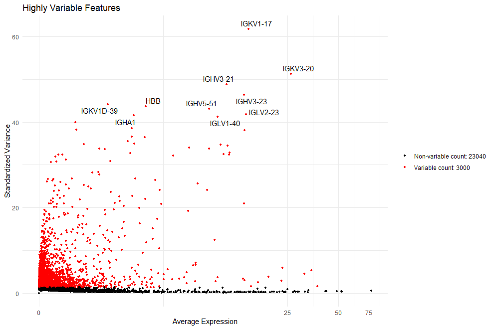

## 📉 3. Dimension Reduction : Principal Component Analysis (PCA) and Visualization
```r
### Step: Principal Component Analysis (PCA) and Visualization

#### Step 1: Scale the Data

# Scale only the variable features to reduce noise and improve computation time
df <- ScaleData(df, features = VariableFeatures(object = df))

#### Step 2: Perform PCA

# Run PCA on the scaled variable features
df <- RunPCA(df, features = VariableFeatures(object = df))

#### Step 3: View Top Genes Contributing to PCs

# Display the most important genes contributing to the top 6 principal components
print("Top genes contributing to the first 6 principal components:")
print(df[["pca"]], dims = 1:6, nfeatures = 5)

#### Step 4: Visualize PCA Loadings

# Plot the top 15 genes contributing to each of the first 6 PCs
VizDimLoadings(df, dims = 1:6, nfeatures = 15, reduction = "pca") + 
  ggtitle("Top Genes in PCA Loadings")
```
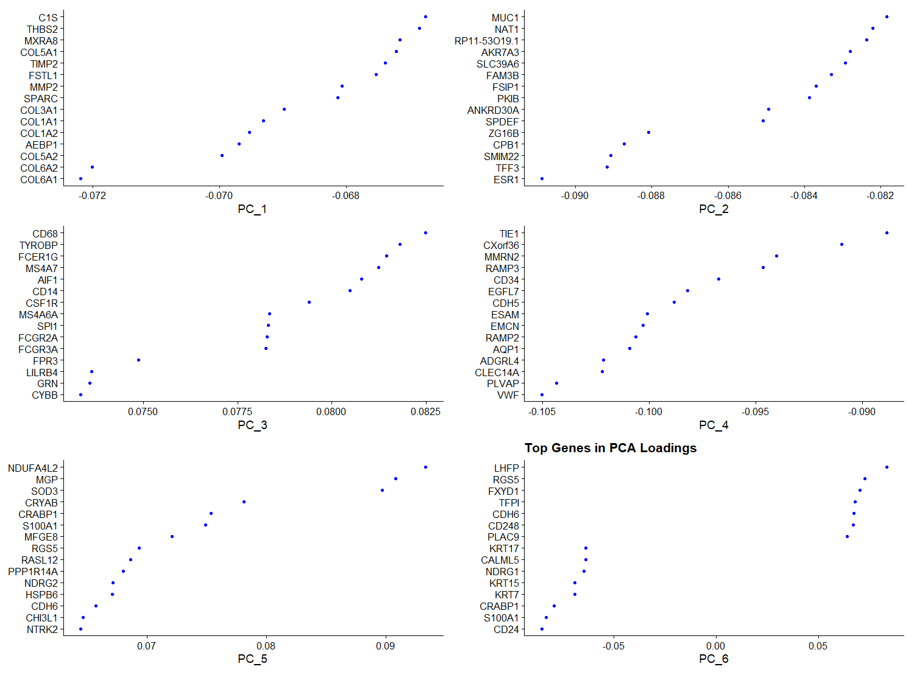
```r
#### Step 5: PCA Plot

# Visualize the PCA results in a basic PCA plot
DimPlot(df, reduction = "pca") + 
  ggtitle("PCA Plot")
```
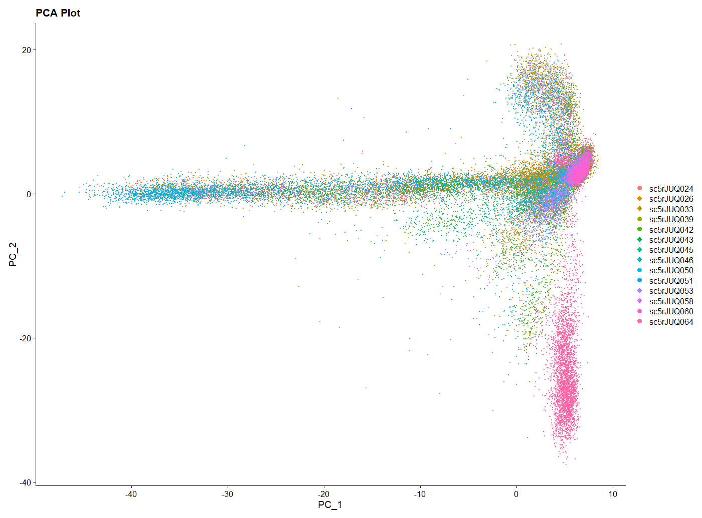
```r

#### Step 6: Dimensional Heatmap

# Dimensional heatmap for the first 2 PCs with a subset of 500 cells for clarity
DimHeatmap(df, dims = 1:2, cells = 500, balanced = TRUE)
```
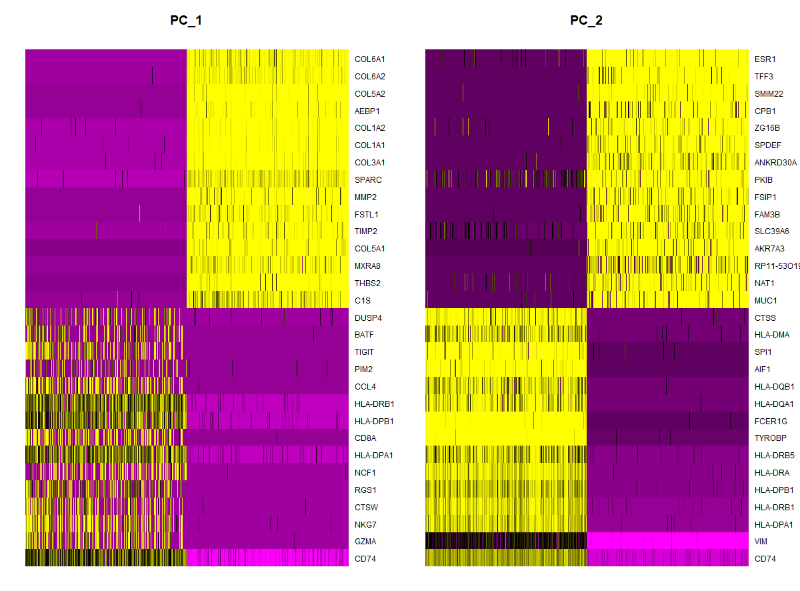
```r

#### Step 7: Determine Optimal Number of PCs

# Elbow plot to determine the optimal number of principal components
ElbowPlot(df) + 
  ggtitle("Elbow Plot - PCA")
```
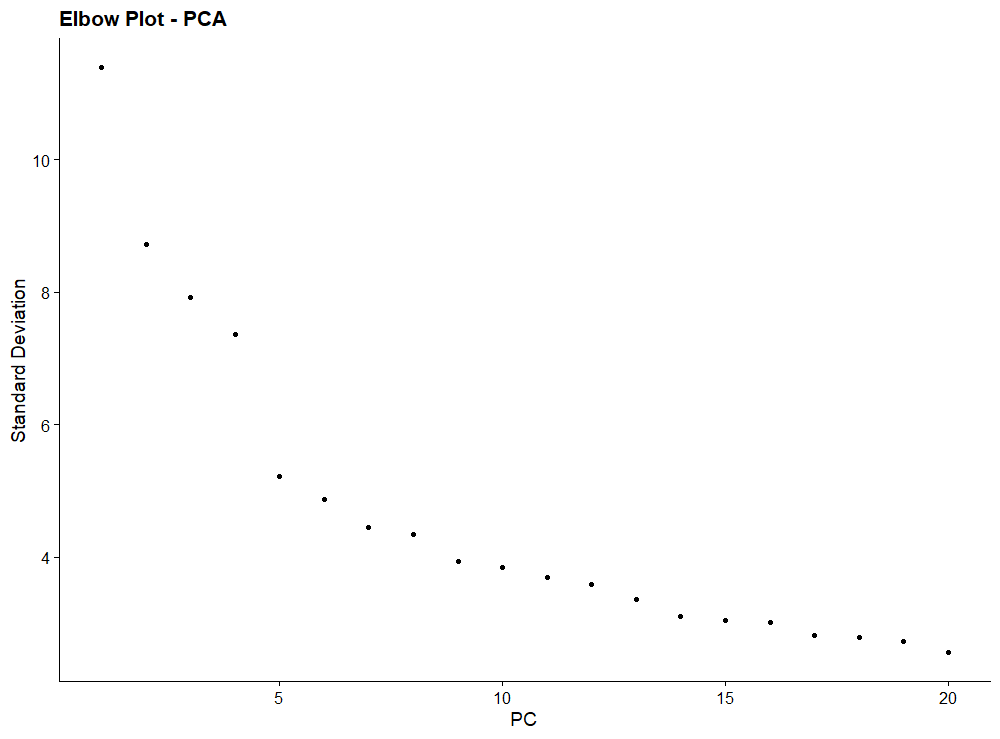


## 🗺️ 4. Clustering the Cells
```r
### Step: Clustering and Dimensional Reduction

#### Step 1: Find Neighbors and Identify Clusters

# Identify neighbors using the first 10 principal components
df <- FindNeighbors(df, dims = 1:10)

# Perform clustering with a resolution of 0.5
df <- FindClusters(df, resolution = 0.5)

# Display cluster IDs for the first 5 cells
head(Idents(df), 5)

#### Step 2: Run Dimensional Reduction (UMAP and t-SNE)

# Run UMAP for non-linear dimensional reduction
df <- RunUMAP(df, dims = 1:10, verbose = FALSE)

# Run t-SNE for an alternative dimensional reduction
df <- RunTSNE(df, dims = 1:10, verbose = FALSE)

#### Step 3: Explore Cluster Metadata

# Display the number of cells per cluster
table(df@meta.data$seurat_clusters)

#### Step 4: Visualize Clusters Using UMAP and t-SNE

# UMAP plot with cluster labels
DimPlot(df, reduction = "umap", label = TRUE, repel = TRUE) + 
  ggtitle("UMAP of Clusters")
```
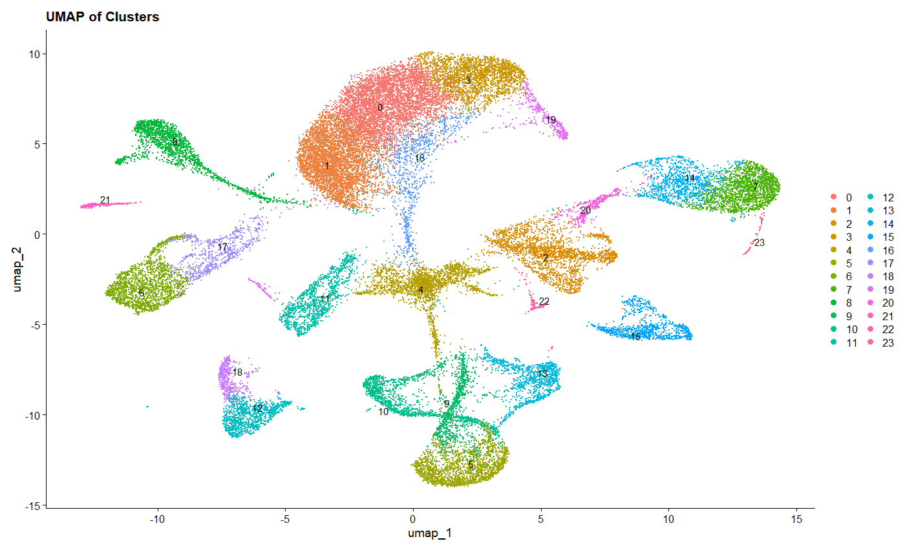
```r
# t-SNE plot with cluster labels
DimPlot(df, reduction = "tsne", label = TRUE, repel = TRUE) + 
  ggtitle("t-SNE of Clusters")
```
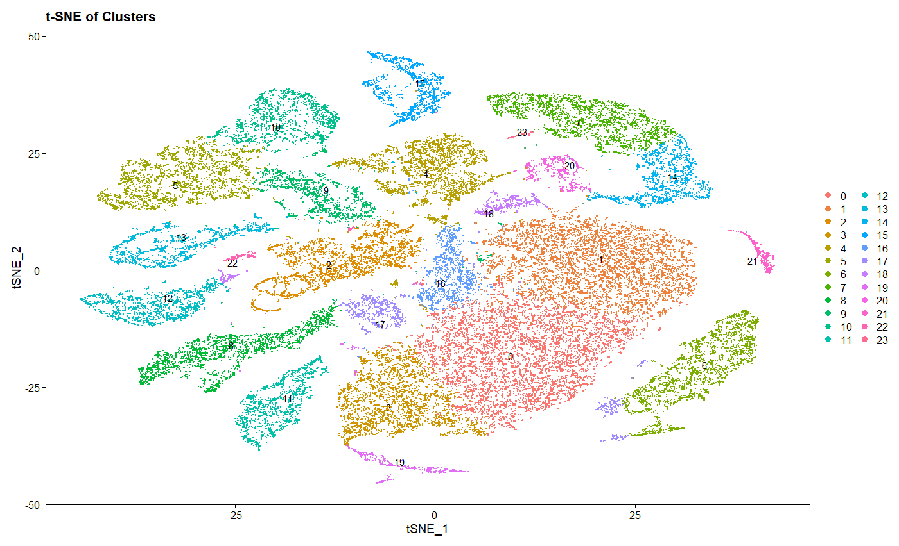

## 🔍 5. Finding Cluster-Specific Marker Genes
```r
### Step: Identify Cluster-Specific Markers

#### Step 1: Find Markers for Cluster 1

# Identify markers for cluster 1 with a minimum expression percentage of 25%
cluster1.markers <- FindMarkers(df, ident.1 = 1, min.pct = 0.25)

# Display the top 5 markers for cluster 1
head(cluster1.markers, n = 5)

#### Step 2: Visualize Top Markers for Cluster 1

# Violin plot for the top 2 markers of cluster 1
VlnPlot(df, features = c(row.names(cluster1.markers)[1], row.names(cluster1.markers)[2]))
```
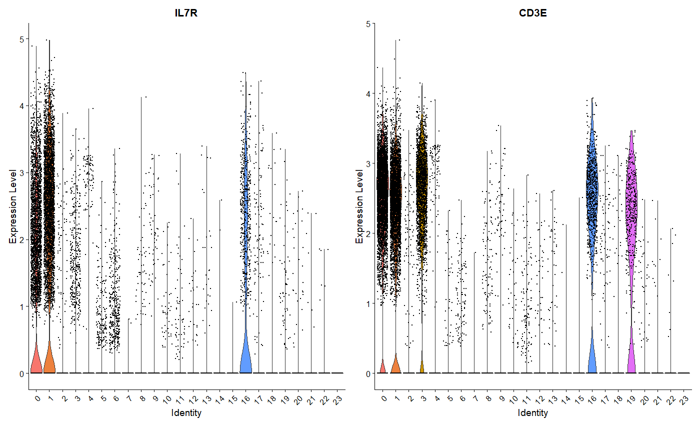
```r
#### Step 3: Find Markers for All Clusters

# Identify markers for all clusters with a log-fold change threshold of 0.5
df.markers <- FindAllMarkers(df, only.pos = TRUE, min.pct = 0.25, logfc.threshold = 0.5) %>%
  filter(p_val_adj < 0.05)  # Optional: Filter markers by adjusted p-value

#### Step 4: Identify Top Markers for Each Cluster

# Get the top 3 marker genes for each cluster based on average log-fold change
top_markers <- df.markers %>% 
  group_by(cluster) %>% 
  top_n(n = 3, wt = avg_log2FC)
```

## 📊 6. Plotting Marker Genes
```r
### Step: Visualize Marker Genes on UMAP

#### Step 1: Plot Top Marker Gene of Each Cluster

# Identify the top marker gene for each cluster
top_markers_1 <- df.markers %>% 
  group_by(cluster) %>% 
  top_n(n = 1, wt = avg_log2FC)

# Plot the top marker genes for the first 12 clusters in groups of 4
FeaturePlot(df, features = top_markers_1$gene[1:4])
FeaturePlot(df, features = top_markers_1$gene[5:8])
FeaturePlot(df, features = top_markers_1$gene[9:12])
```
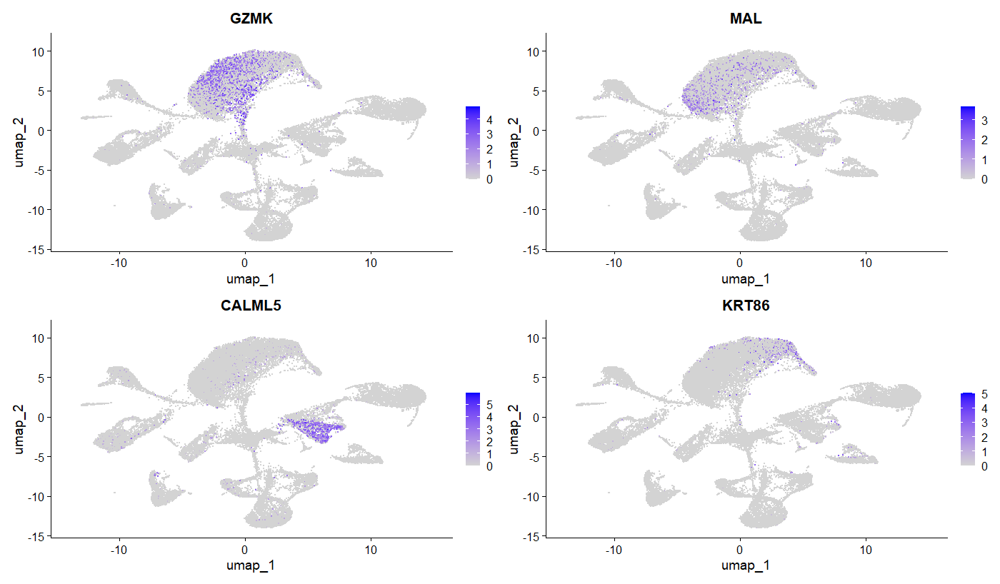
```r
#### Step 2: Visualize Known Cell Type Markers from PanglaoDB

# Plot for Fibroblasts (COL6A2)
FeaturePlot(df, "COL6A2") + 
  scale_colour_gradientn(colours = rev(brewer.pal(n = 11, name = "Spectral"))) + 
  ggtitle("COL6A2: Fibroblasts")
```
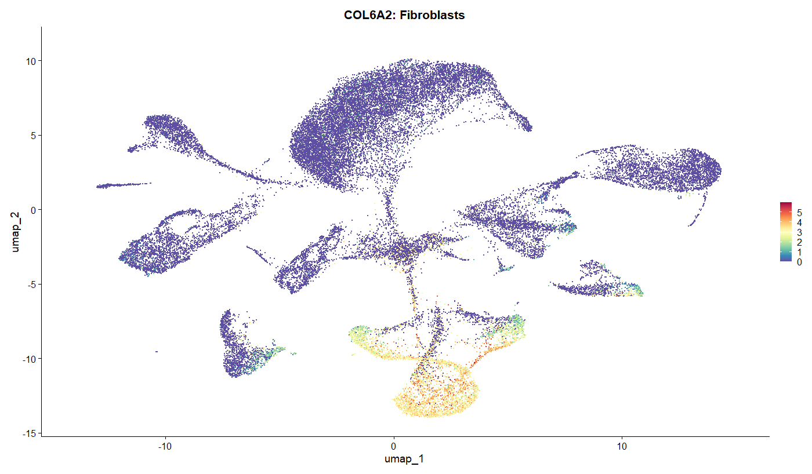
```r

# Plot for T Cells (IL7R)
FeaturePlot(df, "IL7R") + 
  scale_colour_gradientn(colours = rev(brewer.pal(n = 11, name = "Spectral"))) + 
  ggtitle("IL7R: CD4 T Cells")
```
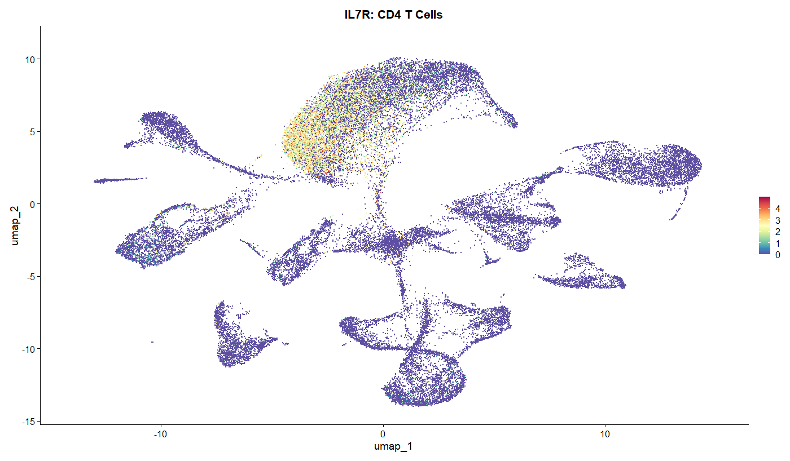
```r

# Plot for Epithelial Cells (KRT14)
FeaturePlot(df, "KRT14") + 
  scale_colour_gradientn(colours = rev(brewer.pal(n = 11, name = "Spectral"))) + 
  ggtitle("KRT14: Epithelial Cells")
```
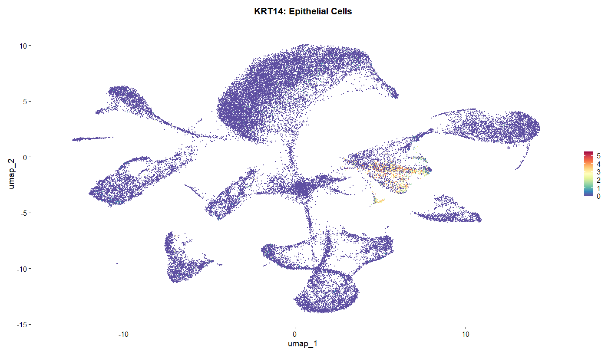
```r

#### Step 3: Plot Top 3 Marker Genes for Specific Clusters

# Plot top 3 marker genes for cluster 0
filtered_x <- top_markers %>% filter(cluster == 0)
FeaturePlot(df, features = filtered_x$gene[1:3])
```
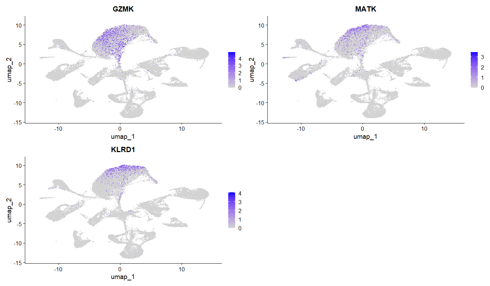

```r
# Plot top 3 marker genes for cluster 3
filtered_x <- top_markers %>% filter(cluster == 3)
FeaturePlot(df, features = filtered_x$gene[1:3])
```
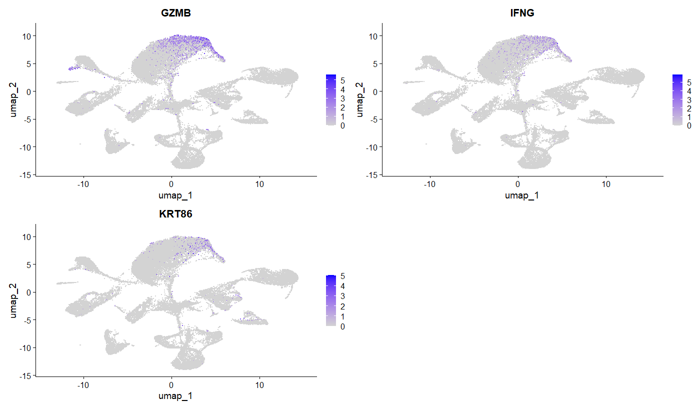


## 🧬 7. Cell Type Annotation
```r
#### Step 1: Load Multiple Reference Datasets for Annotation

# Load Human Primary Cell Atlas reference
ref_human_primary <- celldex::HumanPrimaryCellAtlasData()

# Load Blueprint/ENCODE reference for additional coverage of immune cells
ref_blueprint <- celldex::BlueprintEncodeData()

# Inspect reference datasets
print(ref_human_primary)
print(ref_blueprint)

#### Step 2: Convert Seurat Object to SingleCellExperiment

# Convert Seurat object to SingleCellExperiment using DietSeurat to save memory
sce <- as.SingleCellExperiment(DietSeurat(df))

#### Step 3: Run SingleR for Cell Type Annotation Using Multiple References

# Run SingleR with Human Primary Cell Atlas reference
results_primary <- SingleR(test = sce, assay.type.test = 1, ref = ref_human_primary, labels = ref_human_primary$label.main)

# Run SingleR with Blueprint/ENCODE reference for comparison
results_blueprint <- SingleR(test = sce, assay.type.test = 1, ref = ref_blueprint, labels = ref_blueprint$label.main)

#### Step 4: Compare and Consolidate Annotations

# Create a consensus annotation by comparing the two results
results_consensus <- ifelse(!is.na(results_primary$pruned.labels), 
                            results_primary$pruned.labels, 
                            results_blueprint$pruned.labels)

# Add annotations to the Seurat object metadata
df@meta.data$celltype_primary <- results_primary$pruned.labels
df@meta.data$celltype_blueprint <- results_blueprint$pruned.labels
df@meta.data$celltype_consensus <- results_consensus

#### Step 5: Assess Annotation Confidence

# Plot annotation scores to visualize confidence levels
plotScoreHeatmap(results_primary, main = "Annotation Scores - Human Primary Cell Atlas")
```
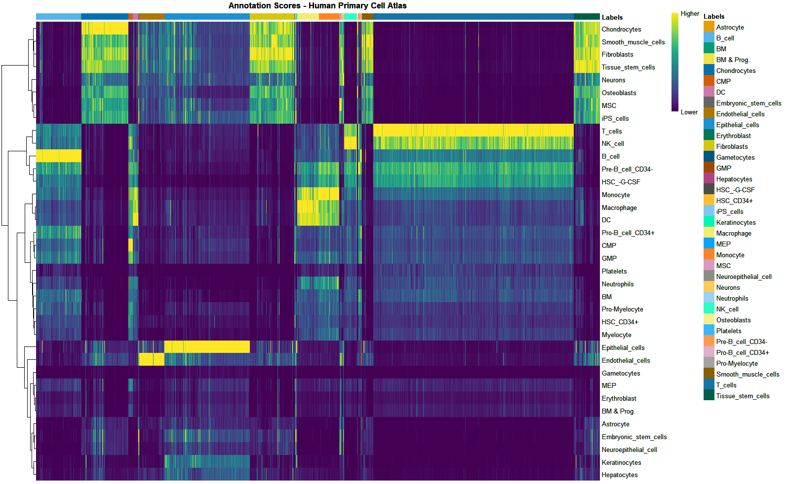
```r
plotScoreHeatmap(results_blueprint, main = "Annotation Scores - Blueprint/ENCODE")
```
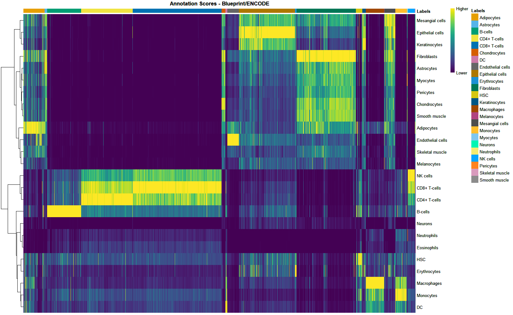
```r
#### Step 6: Visualize Annotations and Save Plots

# Set Seurat object identities to consensus cell types and visualize with UMAP
png("Consensus_Annotations.png", width = 2000, height = 1500, res = 300)
df <- SetIdent(df, value = "celltype_consensus")
DimPlot(df, label = TRUE, repel = TRUE, label.size = 3) + NoLegend() + 
  ggtitle("Consensus Cell Type Annotations")
dev.off()
```
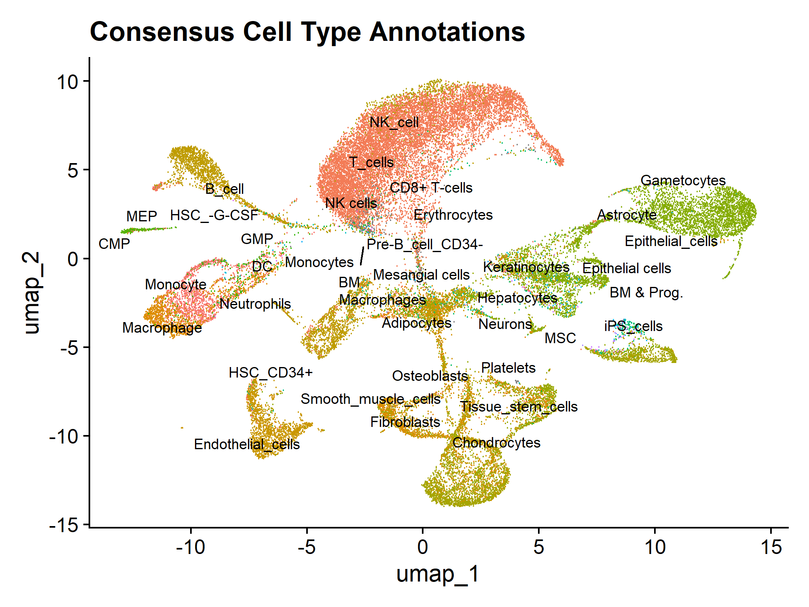
```r

# Visualize and save plot for Human Primary Cell Atlas annotations
png("HumanPrimaryCellAtlas_Annotations.png", width = 2000, height = 1500, res = 300)
df <- SetIdent(df, value = "celltype_primary")
DimPlot(df, label = TRUE, repel = TRUE, label.size = 3) + NoLegend() + 
  ggtitle("Human Primary Cell Atlas Annotations")
dev.off()
```
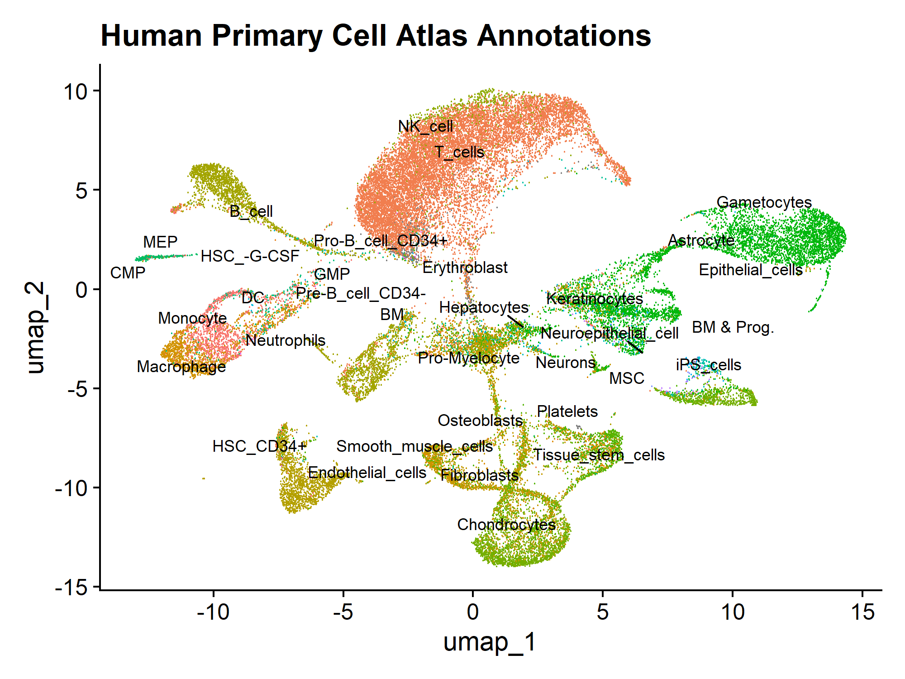
```r

# Visualize and save plot for Blueprint/ENCODE annotations
png("BlueprintEncode_Annotations.png", width = 2000, height = 1500, res = 300)
df <- SetIdent(df, value = "celltype_blueprint")
DimPlot(df, label = TRUE, repel = TRUE, label.size = 3) + NoLegend() + 
  ggtitle("Blueprint/ENCODE Annotations")
dev.off()
```
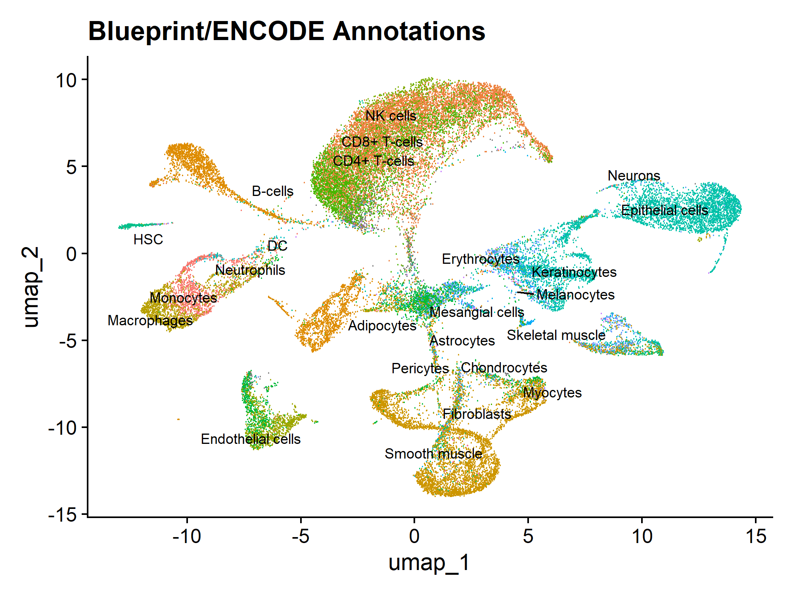
```r

#### Step 7: Verify Cell Type Annotations

# Check levels of the consensus annotations
levels(df)

# Display the number of cells in each annotation
table(df@meta.data$celltype_consensus)

```

## 🔎 8. Identifying Different Cell Types Within a Cluster
```r
#identifying the different cell types of T/NK cells

#### Step 1: Subset T and NK Cells

# Subset Seurat object to include only CD4+ T-cells, CD8+ T-cells, and NK cells
T_df <- subset(df, idents = c("CD4+ T-cells", "CD8+ T-cells", "NK cells"))

#### Step 2: Identify Markers for T/NK Cell Subclusters
# Find markers for T/NK cell subclusters with stringent criteria
T_df.markers <- FindAllMarkers(T_df, only.pos = TRUE, min.pct = 0.5, logfc.threshold = 0.5)

# Display the top 5 markers per cluster for an overview
top_markers <- T_df.markers %>% group_by(cluster) %>% top_n(n = 5, wt = avg_log2FC)
print(top_markers)

#### Step 3: Visualize T/NK Cell Clusters on UMAP

# Visualize T/NK cells with cluster labels
DimPlot(T_df, label = TRUE, repel = TRUE, label.size = 3) + 
  ggtitle("T/NK Cell Clusters") + 
  NoLegend()
```
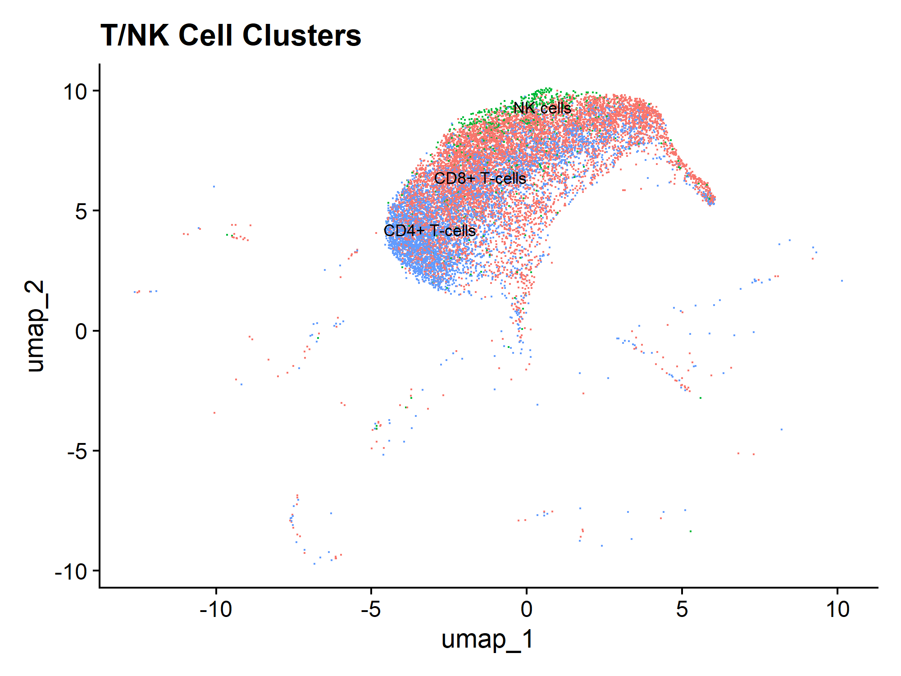
```r

#### Step 4: Plot Top 3 Genes with Highest Expression

# Identify the top 3 genes with the highest average expression
top3_genes <- T_df.markers %>% top_n(n = 3, wt = avg_log2FC)
print(top3_genes)

# UMAP visualization for the top 3 marker genes
png("T_NK_Top3_Markers.png", width = 2500, height = 1500, res = 300)
FeaturePlot(T_df, features = top3_genes$gene, ncol = 3)
dev.off()
```
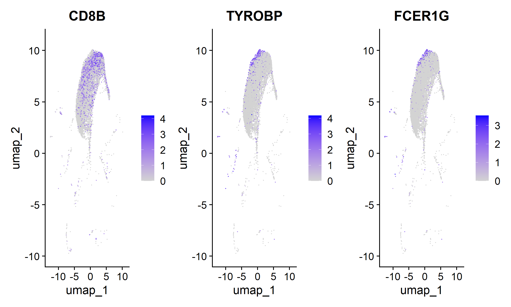
```r
#### Step 5: Fine-Grained Annotation of T/NK Cells Using SingleR

# Convert Seurat object to SingleCellExperiment for SingleR annotation
sce_T <- as.SingleCellExperiment(DietSeurat(T_df))

# Load relevant reference dataset for fine-grained annotation
ref <- celldex::HumanPrimaryCellAtlasData()  # Replace with other references if needed

# Run SingleR for fine-grained annotation
results_T.fine <- SingleR(test = sce_T, assay.type.test = 1, ref = ref, labels = ref$label.fine)

# Add annotations to the Seurat object metadata
T_df@meta.data$results_T.fine <- results_T.fine$pruned.labels

#### Step 6: Explore and Save Fine-Grained Annotations

# Display the distribution of different cell types in T/NK cells
T_NK_cell_types <- table(results_T.fine$pruned.labels)
print(T_NK_cell_types)

# Save the cell type counts as a CSV file
write.csv(T_NK_cell_types, file = "T_NK_cells.csv", quote = FALSE, row.names = TRUE)

#### Step 7: Visualize Fine-Grained Annotations on UMAP

# Set the identities to the fine-grained annotations
T_df <- SetIdent(T_df, value = "results_T.fine")

# UMAP plot with fine-grained cell type labels
png("T_NK_FineGrained_Annotations.png", width = 2000, height = 1500, res = 300)
DimPlot(T_df, label = TRUE, repel = TRUE, label.size = 3) + 
  ggtitle("Fine-Grained Annotation of T/NK Cells") + 
  NoLegend()
dev.off()
```
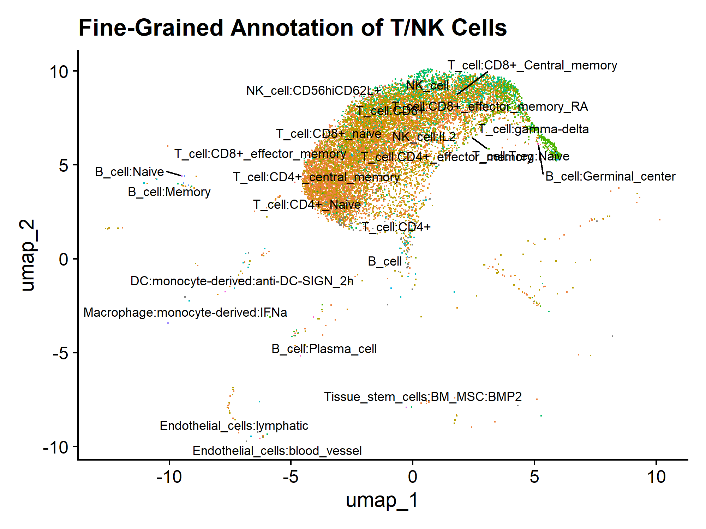

## ⚖️ 9. Identifying differential marker genes
```r
#### Step 1: Subset Myeloid Cells
# Set the active identity class to 'celltype_consensus'
df <- SetIdent(df, value = "celltype_consensus")

# Check the new levels
levels(df)

# Subset Seurat object to include only myeloid-related cells
# Subset using celltype_consensus identities
myeloid <- subset(df, idents = c("Monocyte", "Neutrophils", "Macrophage", "Erythroblast", "Platelets"))

#### Step 2: Normalize and Identify Variable Features
# Set default assay to RNA
DefaultAssay(myeloid) <- "RNA"

# Normalize the data using SCTransform for better variance stabilization
myeloid <- SCTransform(myeloid, verbose = FALSE)

# Identify the top 2000 most variable features
myeloid <- FindVariableFeatures(myeloid, selection.method = "vst", nfeatures = 2000)

#### Step 3: Scale the Data
# Scale the data using variable features
myeloid <- ScaleData(myeloid, features = VariableFeatures(myeloid))

#### Step 4: Differential Expression Analysis

# Perform differential expression analysis for myeloid cells
# Compare Monocytes, Neutrophils, Macrophages, Erythrocytes, and Platelets
myeloid.markers <- FindAllMarkers(
  myeloid, 
  only.pos = TRUE, 
  min.pct = 0.5, 
  logfc.threshold = 0.5,
  assay = "SCT"  # Use the SCTransform assay
)

# Display the top 5 markers per cluster for an overview
top_markers <- myeloid.markers %>% group_by(cluster) %>% top_n(n = 5, wt = avg_log2FC)
print(top_markers)

#### Step 5: Identify and Save Top 10 Markers per Cluster

# Get the top 10 markers per cluster
myeloid_top10_markers <- myeloid.markers %>% group_by(cluster) %>% top_n(n = 10, wt = avg_log2FC)

# Save the top 10 markers to a CSV file
write.csv(myeloid_top10_markers, file = "myeloid_top10_markers.csv", quote = FALSE, row.names = FALSE)

#### Save Violin Plot of Top 5 Markers per Cluster
VlnPlot(myeloid, features = unique(myeloid_top10_markers$gene[1:5]), ncol = 2, pt.size = 0.1) 
```
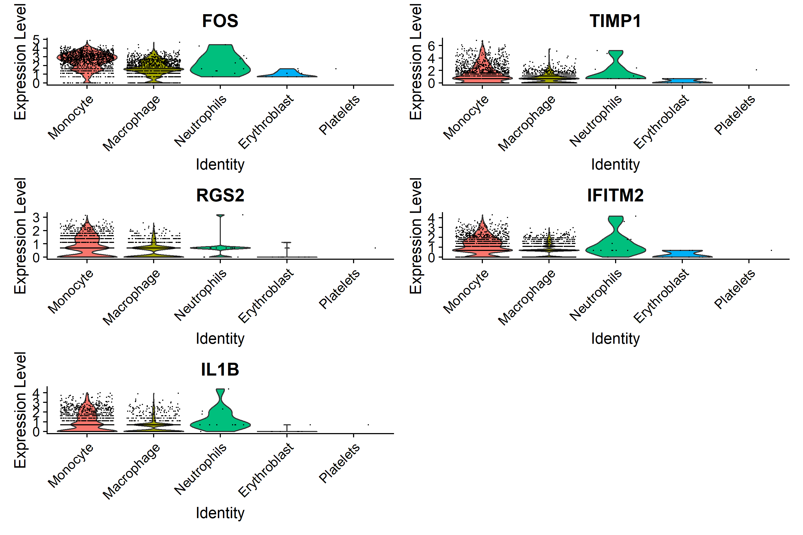

📬 Contact
For any questions, suggestions, or issues, please reach out via:

Email: bioinfosourabh@gmail.com
